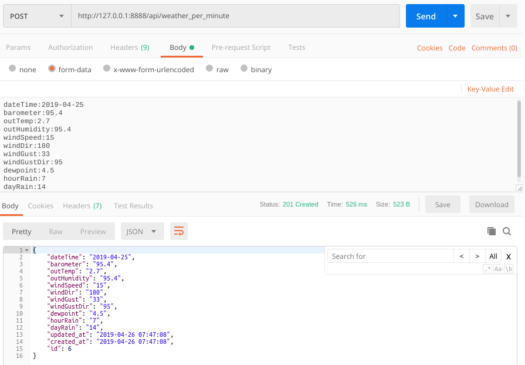
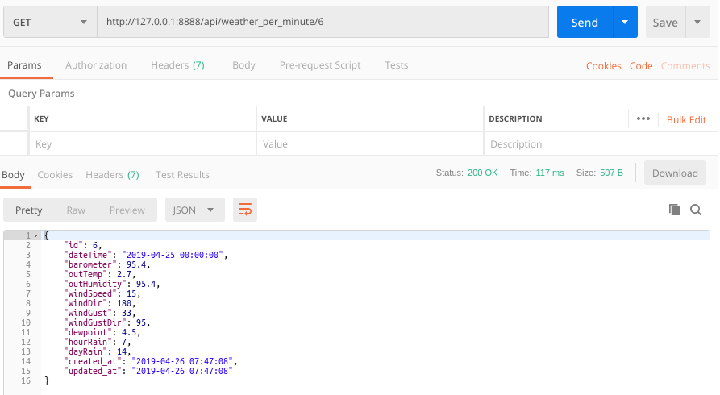

// === SETTINGS === \\

:doctype: book

// -- Table of Contents

:toc:
:toclevels: 3
//:toc-title: Table of Contents // custom ToC title
:toc-placement!:

// -- Icons

ifdef::env-github[]

:caution-caption: :fire:
:important-caption: :exclamation:
:note-caption: :paperclip:
:tip-caption: :bulb:
:warning-caption: :warning:
endif::[]

ifdef::env-github[]
:status:
:outfilesuffix: .adoc
endif::[]

:sectanchors:
:numbered:

// -- Variables
:project_name: WEEWX-API

= PHP: __{project_name}__

toc::[]

// === SETTINGS END === \\

# Introduction
This is the php part, build on the Lumen framework.

# Test the API
## Config
Set up the `.env` File like this:
....
APP_NAME=weapi
APP_ENV=local
APP_KEY=
APP_DEBUG=true
APP_URL=http://localhost
APP_TIMEZONE=Europe/Berlin

LOG_CHANNEL=stack
LOG_SLACK_WEBHOOK_URL=

DB_CONNECTION=mysql
DB_HOST=127.0.0.1
DB_PORT=3306
DB_DATABASE=weapi
DB_USERNAME=weapi
DB_PASSWORD=YOUR_PASSWORD

CACHE_DRIVER=file
QUEUE_CONNECTION=sync

....

## Run the Server
### MySQL Server
Set up a MySQL Server of your choice. For example use the build in server of XAMPP.

### PHP Server
The simplest way: `php -S localhost:8888 -t public`

## Generate MySQL data tables
....
php artisan migrate
....
should create the data tables, defined in `database/migrations/`.
Make sure your `.env` file contains the correct MySQL settings.

## Use it
I prefer Postman for API testing.

### Create an entry [POST]

### Get the entry [GET]

